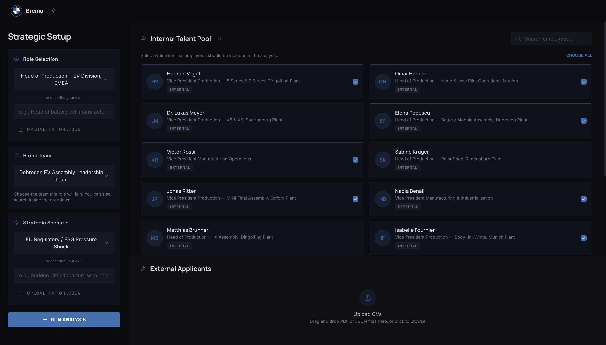
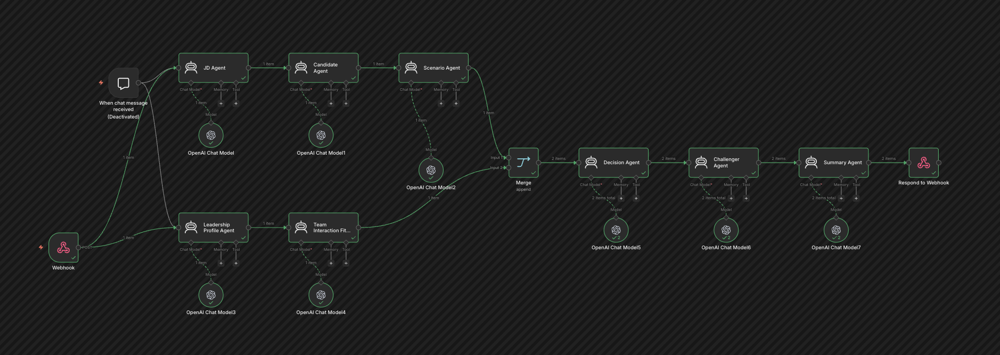
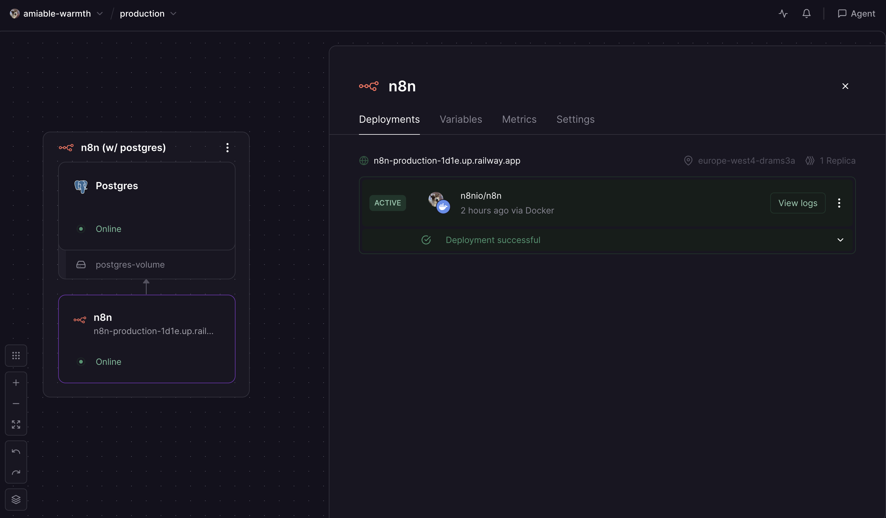
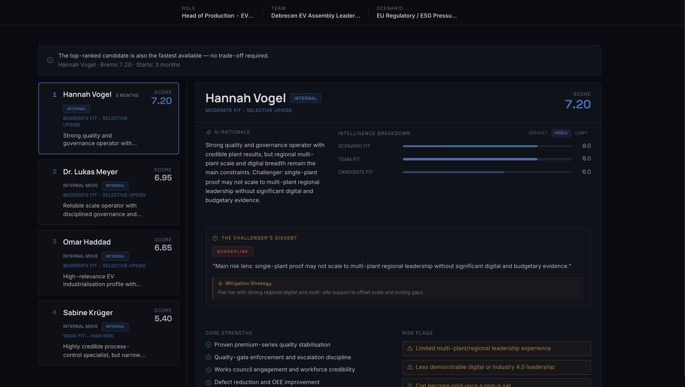
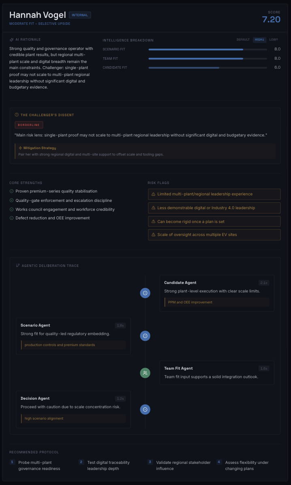

# Bremo AI Hire

Strategic hiring intelligence for high-impact roles.

Bremo AI Hire helps hiring teams make better decisions when stakes are high and trade-offs are real. Instead of producing a simple candidate ranking, it generates a defensible recommendation package that combines role fit, scenario fit, team dynamics, execution risk, and challenge testing.

Demo: `bremo-insight-hiring.lovable.app`



## The Problem We Solve

Most hiring processes break down when organizations recruit for senior or business-critical roles:

- CV review is inconsistent and difficult to compare across internal and external talent.
- Interview panels over-index on intuition, recency bias, or strongest personalities in the room.
- Hiring decisions ignore context shifts (turnaround, expansion, stability, transformation).
- Teams optimize for speed-to-fill, then discover role mismatch and integration issues later.
- Committee discussions produce opinions, not structured evidence that can be audited.

Bremo addresses this by converting hiring into a structured, explainable decision workflow with clear ownership of scoring, reasoning, and challenge.

## How Bremo Solves It

Bremo runs a multi-agent pipeline designed for committee-grade decisions:

- **Role Intelligence**: defines what matters for the role using fixed criteria.
- **Candidate Evaluation**: scores each candidate with evidence-backed reasoning.
- **Scenario Calibration**: adjusts priorities for the active business context.
- **Team Interaction Analysis**: predicts compatibility and execution friction.
- **Decision + Challenger Layer**: explains ranking and pressure-tests the recommendation.
- **Executive Synthesis**: packages the output into a clear brief for action.

The result is a transparent recommendation that leaders can defend, challenge, and operationalize.

## High-Level Architecture

```text
UI Inputs -> Prompted Agent Pipeline -> Python Scoring Engine -> Decision/Challenger -> Executive Brief + UI Payload
```

Core principle: each layer has a single responsibility, and numerical score ownership is separated from narrative ownership.

## n8n Orchestration and CV Intelligence

n8n is a core part of the product, not an add-on automation.

- Receives external CV uploads via webhook from the frontend.
- Orchestrates parsing, normalization, and candidate record standardization.
- Enforces a consistent input contract so internal and external profiles are comparable.
- Routes structured payloads to downstream analysis steps with predictable schema.

This orchestration layer is deployed on Railway for reliable workflow execution and operational continuity.




## Prompt Engineering as a System Capability

Prompt engineering in Bremo is structured as an architecture discipline, not one-off prompt writing.

- **Modular prompts by agent responsibility**: each agent solves one bounded decision task.
- **Strict output contracts**: machine-readable schemas reduce variance and downstream breakage.
- **Guardrails and boundaries**: scoring agents do not rank, explanation agents do not rescore, challenger does not rerank.
- **Confidence and evidence layering**: each output includes strength/uncertainty signals for auditability.
- **Deterministic handoffs**: every step receives normalized inputs and produces typed outputs.

This design improves consistency, explainability, and trust in AI-assisted hiring decisions.

## Scoring and Decision Logic

At a high level, Bremo combines scenario relevance and team execution readiness:

1. Scenario-weighted role score is computed from candidate criterion scores and scenario-adjusted weights.
2. Final score blends scenario-weighted score and team-fit score.

Formula:

`BREMO Score = (scenario_weighted_score * 0.75) + (team_fit_score * 0.25)`

Python is the source of truth for numerical ranking. Decision-focused agents explain and stress-test that ranking without altering the math.

## Product Walkthrough

### 1) Setup and Search Context

Users configure role, scenario, team context, and candidate inputs before launching analysis.


### 2) Results Command Center

The results interface presents ranked candidates, speed-vs-fit trade-offs, rationale, risk flags, and recommended protocol.



### 3) Individual Candidate Intelligence

Each candidate view includes detailed analysis: reasoning, intelligence breakdown, radar profile, mitigation strategy, and challenger dissent.



## Why This Matters for Hiring Teams

- **Faster decisions with higher confidence**: less debate over unclear evidence.
- **Better strategic alignment**: hiring recommendations reflect business scenario realities.
- **Lower execution risk**: team-fit and challenger analysis expose failure modes early.
- **Defensible governance**: structured outputs support committee reviews and audit trails.
- **Consistent comparison model**: internal and external candidates are evaluated on the same basis.

## Repository Notes

- Core prompt logic lives under `src/data/agent_prompts/`.
- Input schema and structured contracts are defined in `bremo_v2.json`.
- Screenshot assets used in this README are in `images/`.

## Summary

Bremo AI Hire transforms senior hiring from subjective discussion into structured decision intelligence. Its combination of n8n orchestration, disciplined prompt engineering, and multi-agent analysis helps teams choose not only the strongest candidate on paper, but the right candidate for the actual business moment.
